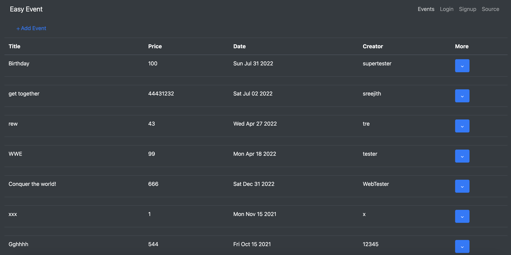

# Event-Booking-App---GraphQL

• Programmed a Full Stack web app having GraphQL API interface allowing travel agents to create travel itineraries.  
• Used NodeJS & Express as core backend server with MongoDB Non-Relational Database for high scalability.  
• Achieved developing the complete user interface with ReactJS as the sole frontend JavaScript framework.
